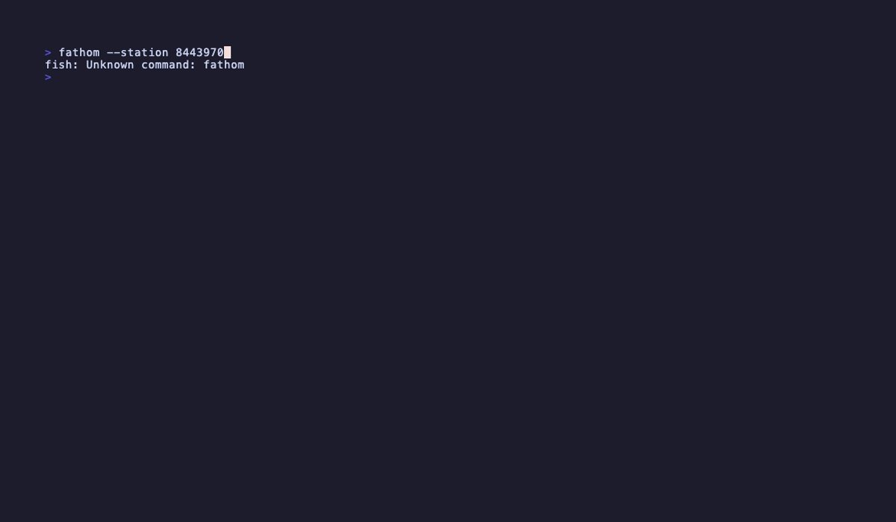

# fathom


[](https://charm.sh)

A terminal tide dashboard powered by NOAA. Three views — live tides, 14-day almanac, station info — in a smooth keyboard-and-mouse-driven TUI. Auto-detects your nearest station on first run. Zero configuration required.

---



---

## Features

**Tide view**
- Midnight-to-midnight fill chart with smooth Catmull-Rom interpolated curve
- Blue→cyan gradient fill; past readings vivid, future predictions in ocean teal
- Live current level with rising ▲ / falling ▼ / steady — indicator
- Next HIGH and LOW countdowns inline
- ← / → arrow keys (or mouse click) to navigate to any date
- `d` to jump to an arbitrary date — type "Oct 11", "Oct 11 2025", or "2025-10-11"
- `t` to snap back to today
- Wind, temperature, and pressure strip from the nearest met buoy

**Almanac view**
- 14-day forecast grid with high/low times, levels, and tidal range
- Moon phase, sunrise, and sunset for each day
- Today highlighted; Enter drills into that day's full tide chart
- Scrollable with ▲/▼ indicators and mouse click to select a day

**Station view**
- Station name, coordinates, timezone, and state in a two-column layout
- Datums table (MLLW, MHW, MHHW, MLW, MLLW, and more)
- Press `s` to search for a different station

**Station picker**
- Auto-detects your location via IP geolocation on first run
- Shows the 8 nearest NOAA water-level stations with distance in km
- Type any station ID directly to jump to a station anywhere in the world
- Selection persists to `~/.config/fathom/config.json`

**Theming**
- Built-in *subaquatic retrofuture* theme — bioluminescent teal, ocean steel blue, phosphor cyan
- Three additional themes: `catppuccin`, `dracula`, `nord`
- Automatically adopts your [Omarchy](https://omarchy.org) theme when detected
- `AdaptiveColor` throughout for correct rendering in both light and dark terminals

**SSH server mode**
- `--serve` runs fathom as a [Wish](https://github.com/charmbracelet/wish) SSH server — no client install needed
- `ssh yourhost -p 23234` gives anyone on your network the full interactive dashboard

---

## Installation

### Homebrew

```bash
brew install mogglemoss/tap/fathom
```

### go install

```bash
go install github.com/mogglemoss/fathom@latest
```

### From source

```bash
git clone https://github.com/mogglemoss/fathom
cd fathom
go build -o fathom .
./fathom
```

---

## Usage

```
fathom [flags]

  --station <id>    NOAA station ID (e.g. 9414290 for San Francisco)
  --theme <name>    Color theme: default, catppuccin, dracula, nord
  --serve           Serve the TUI over SSH using Wish
  --port <n>        SSH server port (default: 23234)
  --host <addr>     SSH server bind address (default: 0.0.0.0)
  --version         Print version and exit
```

On first run, fathom geolocates your IP to find the nearest NOAA water-level station automatically. You can override this at any time with `s` inside the app or the `--station` flag.

Config and theme preferences are saved to `~/.config/fathom/config.json`.

---

## Key Bindings

| Key | Action |
|-----|--------|
| `1` | Tide view |
| `2` | Almanac |
| `3` | Station |
| `tab` | Cycle to next view |
| `↑` / `k` | Scroll up |
| `↓` / `j` | Scroll down |
| `←` / `→` | Previous / next day (tide view) |
| `d` | Jump to an arbitrary date |
| `t` | Jump to today |
| `enter` | Drill into selected day (almanac) |
| `s` | Station search |
| `c` | Toggle 12h / 24h clock |
| `r` | Refresh data |
| `?` | Toggle full help |
| `q` / `ctrl+c` | Quit |

Mouse: click view dots in the status bar to switch views · click ← / → arrows to navigate days · click almanac rows to select.

---

## Technical Specifications

| Parameter | Value |
|-----------|-------|
| Data source | [NOAA Tides & Currents API](https://api.tidesandcurrents.noaa.gov/api/prod/) |
| Station auto-detection | IP geolocation via `ipapi.co` + haversine distance to nearest water-level station |
| Tide chart resolution | 6-minute interval predictions (241 points/day) |
| Almanac forecast | 14 days of HIGH/LOW predictions |
| Poll interval | 60s water level · 6h predictions |
| Theming | Omarchy auto-detected · built-in themes: default, catppuccin, dracula, nord |
| SSH server | [Wish](https://github.com/charmbracelet/wish) · `--serve --port 23234` |
| Runtime dependencies | None |

---

## Not Affiliated

fathom is not affiliated with or endorsed by NOAA. It reads public tide data from the NOAA CO-OPS API and means no harm to the ocean.

---

## License

MIT. See [LICENSE](./LICENSE).
